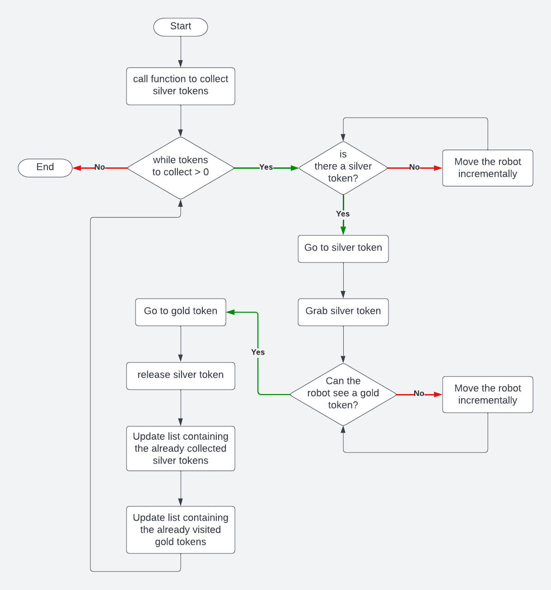

# Research Track 1 - Assignment 1

## Description

In this simulation, we are given a mobile robot that is able to detect informations of the tokens in front of him with a certain angle. The robot is also able to grab/release a token and to move while holding a token. In this configuration we have 6 silver tokens and 6 gold tokens.
The aim of the assignment is to develop a Python script to make the robot grab a silver token and bring it next to a gold token, then repeat this process for every silver box.
The code for the assignment can be found in the file [assignment.py](robot-sim/assignment.py).

## Installing and running

The simulator requires a _Python 2.7_ installation, the [pygame](http://pygame.org/) library, [PyPyBox2D](https://pypi.python.org/pypi/pypybox2d/2.1-r331), and [PyYAML](https://pypi.python.org/pypi/PyYAML/).
All the libraries should be easy to install using `pip`.

Once the dependencies are installed, you can run:
`python2 run.py assignment.py`

## Robot API

The API for controlling a simulated robot is designed to be as similar as possible to the [SR API](https://studentrobotics.org/docs/programming/sr/).
Further instructions on the robot API ca be found in the [README](robot-sim/README.md) inside the [robot-sim](robot-sim/) folder.

## Code description



#### Functions description

- Find a token:
  ```python
  def find_token(token_type, visited_tokens)
  ```

## Results
